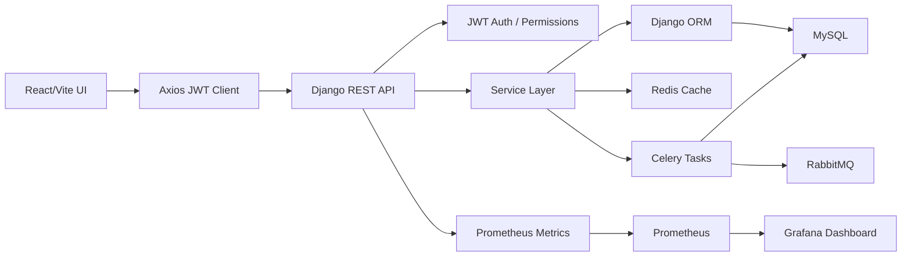

# Astra Sales End-to-End Audit Report

Date: 2026-07-15

## 1. Executive Summary

The application is a Django REST Framework backend, React/Vite frontend, MySQL database, Redis cache, RabbitMQ/Celery background-processing stack, and Prometheus/Grafana observability stack.

Primary bottleneck found: enquiry list endpoints were returning detail-only nested `audit_logs` and `activities` for table/list screens. This increased cold SQL work, serializer cost, and payload size. The backend now uses separate list/detail serializers, and the frontend detail modal fetches full detail on demand.

Correctness fixes were also made for stale lookup caching, duplicate enquiry cache refreshes, SLA activity cache invalidation, and background cache-task logging.

## 2. Architecture Overview

Key modules:

- Backend views: `auth_views`, `user_views`, `master_data_views`, `enquiry_views`, `activity_views`, `dashboard_views`, `export_views`
- Services: `EnquiryService`, `WorkflowEngine`, `CacheService`, `DashboardService`, `EmailService`, `ExportService`
- Frontend pages: dashboard, enquiries, pipeline stage pages, settings, team management
- Background tasks: cache refresh, export, mail, SLA checks

## 3. Performance Bottlenecks

- Fixed: enquiry list serialized nested audit/activity history that is only needed in detail modals.
- Fixed: frontend master-data cache reused the same key for filtered and unfiltered lookup requests.
- Fixed: enquiry create/update used serializer service cache refresh plus inherited view cache refresh, causing duplicate cache refresh attempts.
- Found: `Sidebar.jsx` currently calls `/dashboard/stats/` on route changes. It uses the cached endpoint, but it still adds network pressure and can be reduced to event-driven refresh.
- Found: charts bundle is the largest JS chunk: `407.47 kB` raw, `116.41 kB` gzip.

## 4. Slow Endpoints

Measured with DRF APIClient plus server performance logs, 5 samples per endpoint, cache cleared before each endpoint group.

| Endpoint | Avg ms | P95/P99 ms | Max SQL | Max bytes |
|---|---:|---:|---:|---:|
| `/api/profile/` | 165.83 | 817.79 | 1 | 219 |
| `/api/dashboard/stats/` | 6.28 | 23.38 | 10 cold / 0 warm | 2370 |
| `/api/enquiries/?page=1&page_size=10` | 5.31 | 16.71 | 3 cold / 0 warm | 17794 |
| `/api/enquiries/?page=1&page_size=100&status=Pending with Engg` | 4.79 | 12.88 | 3 cold / 0 warm | 7185 |
| `/api/enquiries/{id}/` | 29.93 | 50.03 | 4 | 1876 |
| `/api/activities/` | 10.98 | 14.06 | 2 | 783 |
| master-data endpoints | 8-14 | 10-19 | 2 | < 1 kB |

`/api/profile/` first request includes authentication/session startup overhead; warm samples were approximately 2 ms.

## 5. Slow SQL Queries

No severe slow SQL was found at current data volume. The unfiltered enquiry list scans the small enquiries table and sorts by `created_at`. This is acceptable now, but should use an index on `created_at` for larger data.

## 6. Missing Indexes

Existing status-filter path uses `enq_status_created_idx` correctly.

Recommended next index before production growth:

- `Enquiry.created_at` descending or composite `(created_at, id)` for unfiltered latest-first list.
- Search currently uses `icontains`, which cannot use normal B-tree indexes efficiently. For high volume, add MySQL full-text indexes for `project_number`, `project_name`, and `rfq_no`.

## 7. N+1 Query Report

No active N+1 remains on enquiry list/detail after the changes:

- List uses `select_related` for FK fields and `prefetch_related('fg_details')`.
- Detail uses `select_related` plus `prefetch_related` for `fg_details`, `audit_logs`, `audit_logs__user`, `activities`, and `activities__user`.

Before fix, cold enquiry list used 7-8 SQL queries. After fix, cold list uses 3 SQL queries and warm cached list uses 0 SQL queries.

## 8. Serializer Performance Report

| Serializer | Rows | Time ms | Bytes |
|---|---:|---:|---:|
| list serializer | 1 | 3.36 | 1996 |
| list serializer | 10 | 5.22 | 19027 |
| list serializer | 20 | 9.99 | 37976 |
| detail serializer | 1 | 3.63 | 2032 |
| detail serializer | 10 | 6.76 | 22419 |
| detail serializer | 20 | 9.22 | 41728 |

The list/detail split removes nested activity/audit payload from list screens while preserving full detail views.

## 9. Cache Analysis Report

Cache is appropriate for dashboard stats and enquiry list pages, with invalidation after enquiry-related mutations.

Fixed:

- Master-data frontend cache now includes query params in the cache key.
- Invalidating `customers`, `sbus`, `divisions`, `rfqs`, or `fgs` now clears all variants such as `customers?page_size=100`.
- SLA warnings now invalidate dashboard/enquiry caches after creating activities.
- Cache refresh tasks use structured logging instead of `print`.

## 10. CRUD Consistency Report

Create/update/delete freshness paths were checked for enquiries, activities, and master data.

Current behavior:

- Create: invalidates enquiry list and dashboard caches.
- Update: invalidates enquiry list and dashboard caches.
- Delete: invalidates enquiry list and dashboard caches.
- Activity changes: invalidate enquiry dependencies.
- Master-data changes: invalidate backend enquiry dependencies and frontend lookup cache.

## 11. Frontend Performance Report

Good:

- Route-level lazy loading is already implemented.
- Vite manual chunks split vendor, charts, and HTTP client.
- Debounced search is present on list pages.

Needs follow-up:

- `Sidebar.jsx` fetches dashboard stats on route changes. Prefer a short client TTL or refresh on mutation events.
- Recharts chunk is the largest bundle. Lazy-load dashboard chart components or split dashboard sections if initial dashboard load is slow.
- Several stage pages duplicate modal/update logic; shared stage editor components would reduce bundle and maintenance cost.

## 12. SOLID Principle Compliance Report

Good:

- Export flow uses service/repository/storage/notifier abstractions.
- Workflow rules are centralized in `WorkflowEngine`.
- User update policy is separated in policy/service layers.

Violations:

- Stage pages have repeated responsibility for fetching, rendering, validating, and updating stage transitions.
- `DashboardService` remains a large aggregation service and should be split into KPI, chart, and recent-quote calculators.
- `ExportJobAPIView.post` streams CSV synchronously while `ExportService` supports async jobs; this is two competing export paths.

## 13. Code Smell Report

Fixed:

- Duplicate cache refresh after enquiry create/update.
- `print` in cache tasks replaced by logger.

Remaining:

- `create_users.py` contains default password seed logic and must not be used in production.
- `exportService.js` describes async export-job behavior, but the active `ExportButton` uses synchronous blob download.
- Some generated trace files are present under backend workspace and should be kept out of commits if not intentional.

## 14. Security Audit Report

High-priority production concerns:

- `DEBUG` defaults to true.
- `ALLOWED_HOSTS` defaults to `*`.
- `SECRET_KEY` has a fallback value.
- Development/default credentials exist in scripts and compose examples.
- JWT tokens are stored in `localStorage`, increasing XSS blast radius.
- Uploaded `FileField` documents need server-side size/content validation.
- Production compose exposes database/cache/broker/metrics services unless network access is restricted.

Existing positives:

- ORM usage avoids raw SQL injection patterns.
- DRF permissions and JWT auth are in place.
- Admin route is commented out.
- Backend production Docker image runs as non-root.

## 15. Bugs Found

- Filtered lookup cache could return stale/wrong unfiltered data.
- SLA background task wrote activities without invalidating cached timelines/dashboard data.
- Enquiry create/update could queue duplicate cache refresh work.
- Enquiry list endpoint returned unnecessary nested history/activity data.

## 16. Bugs Fixed

- Added query-param-aware frontend lookup cache keys.
- Added prefix invalidation for lookup cache variants.
- Added SLA cache invalidation after warning creation.
- Replaced cache-task `print` calls with logger exceptions.
- Added `EnquiryListSerializer` and list-specific queryset prefetching.
- Made enquiry detail modal fetch full detail on demand.

## 17. Refactoring Summary

Changed files:

- `Backend/astra_sales/core/serializers/enquiry.py`
- `Backend/astra_sales/core/views/enquiry_views.py`
- `Backend/astra_sales/core/tasks/cache_tasks.py`
- `Backend/astra_sales/core/tasks/sla_tasks.py`
- `Frontend/frontend_admin/src/pages/Enquiries.jsx`
- `Frontend/frontend_admin/src/services/masterDataService.js`

Pre-existing modified file observed but not authored in this pass:

- `Frontend/frontend_admin/src/components/Sidebar.jsx`

## 18. Benchmark Comparison

| Metric | Before | After |
|---|---:|---:|
| Enquiry list cold max SQL | 7-8 | 3 |
| Enquiry list warm SQL | 0 | 0 |
| Enquiry list avg latency | 9.24 ms | 5.31 ms |
| Enquiry list P95/P99 | 33.77 ms | 16.71 ms |
| Enquiry list payload | 20902 bytes | 17794 bytes |
| Status-filter list avg latency | 6.32 ms | 4.79 ms |
| Dashboard warm SQL | 0 | 0 |
| Frontend build | passed | passed |
| Backend tests | passed | passed |

## 19. Remaining Recommendations

- Add server-side file validators for uploaded documents.
- Harden production env defaults: `DEBUG=False`, explicit hosts, required secret key, restricted CORS.
- Reduce sidebar dashboard polling/fetching.
- Align export UI with either synchronous download or async job service.
- Add full-text search if enquiry volume grows.
- Add Lighthouse/browser tracing in CI for LCP/FCP/TTFB tracking.

## 20. Production Readiness Checklist

- [x] Backend system check passes.
- [x] Backend tests pass.
- [x] Frontend production build passes.
- [x] Grafana/Prometheus stack present.
- [x] Enquiry list N+1 avoided with `select_related`/`prefetch_related`.
- [x] CRUD cache invalidation in place for enquiry-related data.
- [ ] Production secrets must be provided by environment only.
- [ ] Public service ports must be restricted.
- [ ] File upload validation must be enforced server-side.
- [ ] Browser Lighthouse and real-user monitoring should be added for production UX metrics.
